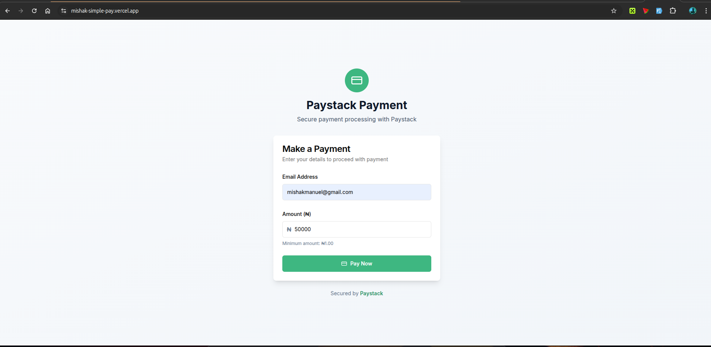
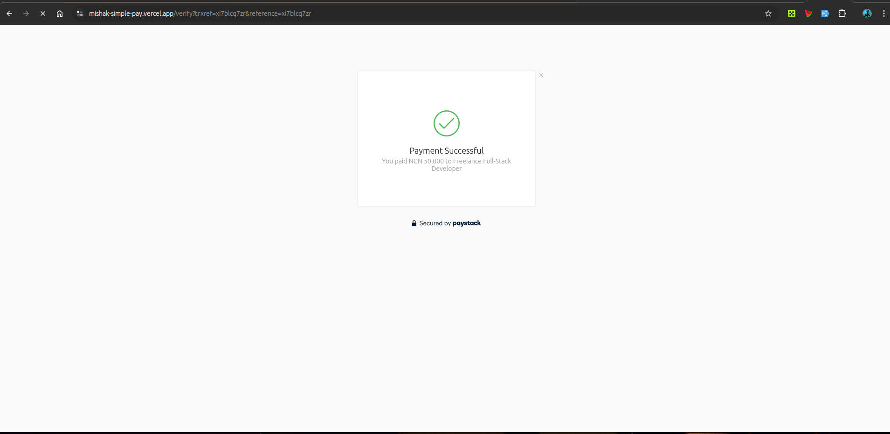
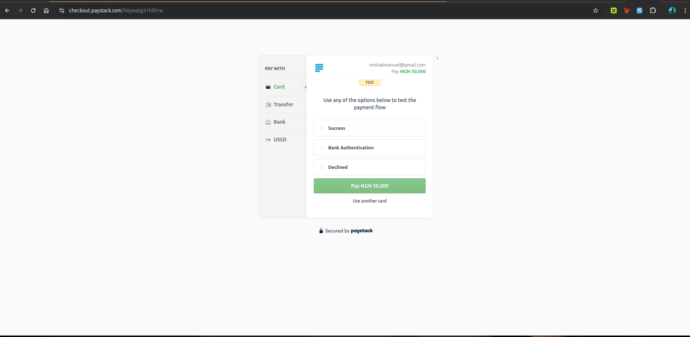
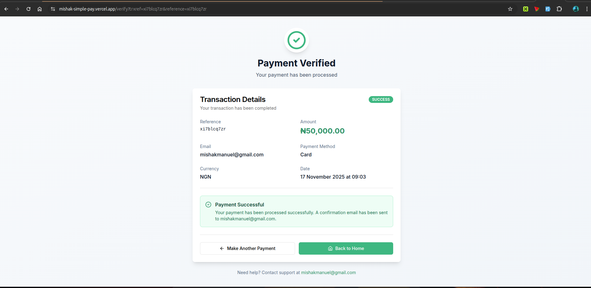

# Mishak Pay Access

A modern Next.js application for testing and integrating Paystack payment processing. This application provides a seamless payment initialization and verification experience using Paystack's API.

## Features

- 💳 **Paystack Payment Integration** - Initialize and process payments securely
- ✅ **Payment Verification** - Verify payment status and retrieve transaction details
- 🎨 **Modern UI** - Built with Tailwind CSS and Radix UI components
- 🔐 **Type-Safe** - Full TypeScript support for enhanced development experience
- 📱 **Responsive Design** - Works seamlessly on desktop and mobile devices
- 🎯 **API Routes** - Secure server-side payment handling

## Tech Stack

- **Framework**: [Next.js 13.5](https://nextjs.org/)
- **Language**: [TypeScript](https://www.typescriptlang.org/)
- **Styling**: [Tailwind CSS 3.3](https://tailwindcss.com/)
- **UI Components**: [Radix UI](https://www.radix-ui.com/)
- **HTTP Client**: [Axios](https://axios-http.com/)
- **Form Handling**: [React Hook Form](https://react-hook-form.com/)
- **Payment Gateway**: [Paystack](https://paystack.com/)

## Prerequisites

Before you begin, ensure you have the following installed:
- Node.js 16.x or higher
- npm or yarn package manager
- A Paystack account with API keys

## Setup Instructions

### 1. Clone the Repository
```bash
git clone https://github.com/Evarmedia/mishak_pay_access.git
cd mishak_pay_access
```

### 2. Install Dependencies
```bash
npm install
# or
yarn install
```

### 3. Environment Configuration

Create a `.env.local` file in the root directory and add your Paystack credentials:

```env
# Paystack API Keys
PAYSTACK_SECRET_KEY=your_paystack_secret_key_here
NEXT_PUBLIC_PAYSTACK_PUBLIC_KEY=your_paystack_public_key_here

# App Configuration
NEXT_PUBLIC_APP_URL=http://localhost:3000
```

**Important**: Replace the placeholder values with your actual Paystack API keys from your [Paystack Dashboard](https://dashboard.paystack.com/).

### 4. Run Development Server
```bash
npm run dev
# or
yarn dev
```

The application will be available at `http://localhost:3000`

## Project Structure

```
mishak_pay_access/
├── app/
│   ├── api/
│   │   ├── initialize-payment/      # Payment initialization endpoint
│   │   │   └── route.js
│   │   └── verify-payment/          # Payment verification endpoint
│   │       └── route.js
│   ├── verify/
│   │   └── page.tsx                 # Payment verification page
│   ├── layout.tsx                   # Root layout component
│   ├── page.tsx                     # Home page
│   └── globals.css                  # Global styles
├── components/
│   └── ui/                          # Reusable UI components
├── hooks/
│   └── use-toast.ts                 # Toast notification hook
├── lib/
│   └── utils.ts                     # Utility functions
├── .env.local                       # Environment variables (local)
├── next.config.js                   # Next.js configuration
├── package.json                     # Dependencies and scripts
├── tailwind.config.ts               # Tailwind CSS configuration
└── tsconfig.json                    # TypeScript configuration
```

## API Endpoints

### Initialize Payment
**Endpoint**: `POST /api/initialize-payment`

Request:
```json
{
  "email": "customer@example.com",
  "amount": 5000
}
```

Response:
```json
{
  "status": true,
  "message": "Authorization URL created",
  "authorization_url": "https://checkout.paystack.com/...",
  "access_code": "xxxxxxx",
  "reference": "xxxxxxx"
}
```

### Verify Payment
**Endpoint**: `POST /api/verify-payment`

Request:
```json
{
  "reference": "transaction_reference"
}
```

Response:
```json
{
  "status": true,
  "message": "Verification successful",
  "data": {
    "reference": "xxxxxxx",
    "amount": 50.00,
    "currency": "NGN",
    "status": "success",
    "paid_at": "2024-01-01T12:00:00.000Z",
    "channel": "card",
    "customer": {
      "email": "customer@example.com",
      "customer_code": "CUS_xxxxxxx"
    },
    "metadata": {}
  }
}
```

## Available Scripts

```bash
# Development server
npm run dev

# Production build
npm run build

# Start production server
npm start

# Run ESLint
npm run lint

# Type checking
npm run typecheck
```

## Deployment

### Deploy to Vercel (Recommended)

1. Push your code to GitHub
2. Connect your repository to [Vercel](https://vercel.com/)
3. Add environment variables in Vercel dashboard:
   - `PAYSTACK_SECRET_KEY`
   - `NEXT_PUBLIC_PAYSTACK_PUBLIC_KEY`
   - `NEXT_PUBLIC_APP_URL` (your deployed URL)
4. Deploy automatically on push

### Deploy to Other Platforms

1. Build the application:
   ```bash
   npm run build
   ```

2. Start the production server:
   ```bash
   npm start
   ```

## Troubleshooting

### Payment Initialization Error: "Failed to initialize payment"
- Verify that `PAYSTACK_SECRET_KEY` is correctly set in `.env.local`
- Ensure the Paystack API key is active in your dashboard
- Check that the API endpoint is accessible

### "dynamic = 'force-dynamic' cannot be used with 'output: export'"
- This has been fixed in the latest configuration
- Ensure `next.config.js` does **not** have `output: 'export'`

### Environment Variables Not Loading
- Restart the development server after adding/updating `.env.local`
- Variables must start with `NEXT_PUBLIC_` to be accessible on the client

## Security Considerations

- 🔒 **Never expose your `PAYSTACK_SECRET_KEY`** in client-side code
- ✅ Always validate payment amounts and user inputs on the server
- ✅ Use HTTPS in production
- ✅ Store transaction records securely
- ✅ Implement proper error handling and logging

## Contributing

Contributions are welcome! Please follow these steps:

1. Fork the repository
2. Create a feature branch (`git checkout -b feature/amazing-feature`)
3. Commit your changes (`git commit -m 'Add amazing feature'`)
4. Push to the branch (`git push origin feature/amazing-feature`)
5. Open a Pull Request

## License

This project is private and proprietary to Evarmedia.

## Support

For issues, questions, or feature requests, please contact the development team or open an issue in the repository.

## Useful Resources

- [Paystack Documentation](https://paystack.com/docs)
- [Next.js Documentation](https://nextjs.org/docs)
- [Tailwind CSS Documentation](https://tailwindcss.com/docs)
- [Radix UI Documentation](https://www.radix-ui.com/docs)

---





Made with ❤️ by Evarmedia
